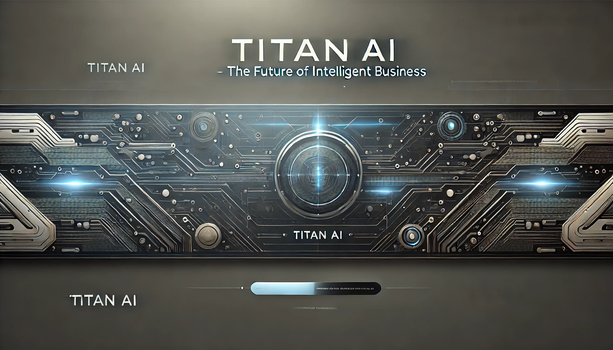

#  Titan AI Smart Contract Assist




## 📖 Overview

Titan AI Smart Contract Assist streamlines the smart contract lifecycle by combining state-of-the-art Agentic AI. It simplifies everything from code generation and interactive editing to comprehensive security auditing and live deployment on testnet network.

Titan AI Smart Contract Assist is an AI-powered solution that lets developers create, test, and deploy smart contracts interactively. With real-time suggestions, security audits, and seamless on-chain deployment, it provides a one-stop solution for smart contract development.


## 🔍 With Titan AI, developers can:

- **Generate Smart Contract Code:** Describe your idea in natural language and receive generated smart contract code.
- **Receive Tailored Recommendations:** Get instant, actionable feedback to enhance security, performance, and functionality.
- **Edit Code Interactively:** Use a powerful multi-file editor to manage and refine your project files.
- **Conduct Security Audits:** Automatically scan contracts for vulnerabilities and obtain detailed security reports.
- **Deploy Seamlessly:** Deploy contracts directly to testnet network.
- **Maintain Context:** Titan AI uses your project’s context (requirements and code files) to provide highly relevant suggestions.

## 💡 Features

- **Interactive Code Generation:** Chat with Titan AI to dynamically generate smart contract code.
- **Real-Time Feedback:** Receive immediate, detailed recommendations for code improvements and security.
- **Multi-File Editor:** Manage multiple files with a sleek, integrated code editor powered by Monaco.
- **Automated Security Audits:** Detect vulnerabilities and receive actionable fixes automatically.
- **Seamless Deployment:** Deploy smart contracts directly to testnet network.
- **Context-Aware Assistance:** Enjoy tailored suggestions based on your project’s requirements and current code.
- **User-Friendly Interface:** Benefit from an intuitive and modern UI that streamlines development.

## 👨‍💻 Use Cases

- **Developers:** Rapidly iterate on smart contract code with AI-driven suggestions, reducing errors and speeding up development.
- **Auditors:** Perform automated security audits and generate comprehensive vulnerability reports.
- **Startups:** Quickly prototype and deploy smart contracts to testnet network, accelerating your time-to-market.
- **Educators:** Demonstrate best practices in smart contract development and blockchain security in an interactive learning environment.

## ⚙️ How It Works

1. **Conversational AI Interface:** Engage with Titan AI via a chat interface. The AI detects the interaction mode (requirements, research, development, audit, deployment, or general) and returns structured, actionable responses.
2. **Context Integration:** The platform continuously updates its context with your project’s requirements and code files, ensuring precise and relevant suggestions.
3. **AgentKit Integration:** AgentKit handles wallet management, contract deployment, and on-chain interactions seamlessly.
4. **Real-Time Collaboration:** Receive immediate feedback on your code, allowing for on-the-fly adjustments and iterative improvement.

## 🔧 How It's Made

Titan AI Smart Contract Assist is built using a modern technology stack:

- **Frontend:**
  - **React & Next.js:** Deliver a dynamic, responsive user interface.
  - **Monaco Editor:** Powers the multi-file code editor for a rich development experience.

- **Backend:**
  - **Node.js & Express:** Serve API endpoints and manage chat sessions.
  - **Coinbase AgentKit:** Enables secure wallet management and on-chain deployment.

- **AI Integration:**
  - **OpenAI's Chat API & LangChain:** Drive the conversational AI for code generation, audits, and suggestions.

- **Security:**
  - Robust measures including reentrancy guards, access control validations, and input sanitization.

- **Deployment:**
  - Seamless integration with test networks using agent toolkit for reliable smart contract deployment.

## 📥 Installation & Setup

1. **Clone the Repository:**
   ```bash
   git clone https://github.com/Web3masters/TitanAI.git
   cd TitanAI/aiagent
   ```
2. **Install Dependencies:**
   ```bash
   npm install --force
   ```
3. **Configure Environment Variables:**
   Create a `.env` file in the project root with:
   ```env
   OPENAI_API_KEY=your_openai_api_key
   CDP_API_KEY_NAME=your_cdp_api_key_name
   CDP_API_KEY_PRIVATE_KEY=your_cdp_api_key_private_key
   NETWORK_ID=Sonic Blaze Testnet
   ```
   
   Sonic Blaze Testnet Details:
   - Network name: Sonic Blaze Testnet
   - RPC URL: https://rpc.blaze.soniclabs.com
   - Explorer URL: https://testnet.sonicscan.org
   - Chain ID: 57054
   - Currency symbol: S
   
4. **Run the Development Server:**
   ```bash
   npm install
   npm run build
   npm start
   ```
5. **Access the Application:**
  ```bash
   cd TitanAI/frontend
   npm install
   npm run dev
   ```

   Open your browser and navigate to [http://localhost:3000](http://localhost:3000)


## 📚 Usage

- **Smart Contract Creation:** Chat with Titan AI to generate and refine smart contract code.
- **Interactive Editing:** Modify your code in real time using the integrated multi-file editor.
- **Security Auditing:** Request automated security audits to identify and fix vulnerabilities.
- **Deployment:** Deploy your contracts directly to testnet network blaze.
- **Export & Download:** Easily export your smart contract files for further testing or live deployment.

## 🤝 Contributing

Contributions are welcome! Please fork the repository and submit a pull request with your improvements. For major changes, open an issue first to discuss your ideas.

## 🚀 Future Enhancements

- **User Authentication:** Implement robust user accounts and persistent project storage.
- **Advanced Analytics:** Integrate detailed analytics for security audits and performance metrics.
- **Collaboration Tools:** Add real-time team collaboration features.
- **Extended Deployment Options:** Support mainnet network and advanced deployment configurations.
- **Enhanced UI/UX:** Continuously refine the interface for an even more intuitive user experience.

## 📄 License

This project is licensed under the MIT License. See the [LICENSE](./LICENSE) file for details.
